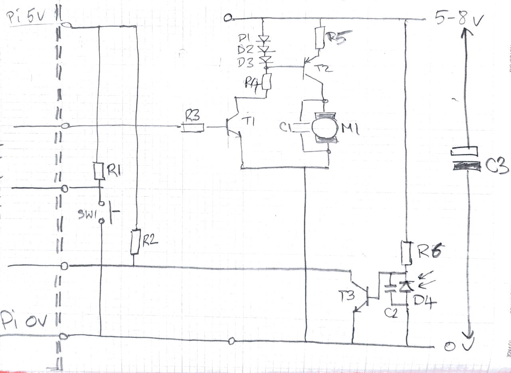

# pitest-2020
## Some initial experiments in physical programming with a Raspberry Pi

Built the following circuit to experiment with basic I/O using a Raspberry Pi

- We're controlling a motor (via transistor/current source) to demonstrate an output device.  
- We're monitoring a switch and photo-diode to test a couple different types of possible input.

The circuit is quite basic, but is sufficient for this experiment.

The Python script `motorTest.py` allows the motor to be started, by pressing the button (SW1), then lets the motor complete 10 revolutions before stopping the motor.  A photodiode (D4) is used to detect when the motor completes a full revolution.

We're handling both the switch and the photodiode with the `gpiozero` `Switch` class.  For the photodiode we had to include some non-default parameters in the constructor to account for the noisy transition between **OFF** and **ON** states.

The motor is handled with the `gpiozero` `Motor` class.  Our circuit doesn't use a *H-bridge* (we drive the motor with a single GPIO pin) but we're still able to control the motor - including adjusting the speed via PWM.  **NOTE:** The second GPIO pin  is required in the initialization of the `Motor` instance (the *reverse* pin) but we simply provided an unused GPIO pin.  Obviously, we are only able to use the `forward()` command when controlling the motor.

  